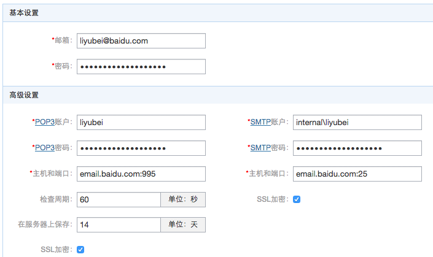

## 简介

EMail Client 基于 [POP3](http://en.wikipedia.org/wiki/Post_Office_Protocol) 和 [SMTP](http://en.wikipedia.org/wiki/Simple_Mail_Transfer_Protocol) 协议来实现邮件的收发功能，UI是基于在 [er](https://github.com/ecomfe/er), [esui](https://github.com/ecomfe/esui), [bat-ria](https://github.com/ecomfe/bat-ria) 的基础上开发的，天生具有很好的扩展性和跨平台的特性。

## 如何使用

为了方便使用，提供了 Mac 和 Windows 下面的编译好的二进制文件，可以从这里下载：<http://pan.baidu.com/s/1bnzYseN>

下载解压之后，在终端里面直接执行即可，如果正常启动成功，然后打开浏览器，访问：<http://localhost:8877> 就可以看到设置页面。



第一次访问的时候会自动跳转到设置页面，此时需要配置一些账户的信息，如果是 baidu.com 或者 126.com 的账户的话，只需要在基本设置里面填写邮箱地址和密码即可，下面的高级设置会自动补全。如果不是这两个域名下面的账户，可能就需要自己人肉去补全相应的信息了。

配置成功之后，点击确定，然后会跳转到邮件列表页面，稍微等一会儿就可以看到最新的邮件了。

### 关联网盘

在邮件列表页面，点击『网盘授权』的按钮，会打开授权页面，授权成功之后会，后续收到的邮件中如果还有附件，会自动同步到百度网盘。

> 需要注意的是，授权的时候，需要保证浏览器的地址是 <http://localhost:8877>，如果是其它地址，可能会失败。

## 系统预览

### 邮件列表


### 邮件搜索


### 发送邮件


### 邮件浏览


### 查看附件

先进行网盘授权，授权之后邮件的附件是自动转存到百度云，方便预览。


## 系统架构图


### BACKEND

1. 基于 POP3 协议跟邮件服务器交互，完成收取邮件的功能
2. 收取邮件之后把解析出来的元信息（例如：标题，发件人，日期等等）存储到数据，原始的文件存储到 Raw 目录。

### FRONTEND

1. 基于 SMTP 协议跟邮件服务器交互，完成发送邮件的功能
2. 实现了一个 Web Server，响应浏览器发送过来的请求，返回合适的 JSON 数据，从而在 ER App 里面展示邮件的信息。

## 环境搭建

基于上面的介绍，搭建环境之前需要有一些依赖的服务需要准备好：

0. [git](http://git-scm.com/)
1. [sqlite](http://www.sqlite.org/) 或者 [mysql](http://mysql.com/downloads)
2. [golang](http://golang.org/doc/install)

**注意事项**

Windows编译需要额外安装[tdm-gcc](http://tdm-gcc.tdragon.net/download)，其它平台下应该没有什么问题，不过还是推荐在 Linux 或者 Mac 下面尝试编译，会方便很多。

### 代码编译

调用`go build`之前，首先需要设置`GOPATH`环境变量，例如：

```
export GOPATH=$HOME/gocode
mkdir -p $HOME/gocode
```

下载所需要的依赖包（只需要下载一次即可，有些可能需要翻墙，请自行解决）

```
go install "github.com/alexcesaro/mail/quotedprintable"
go install "github.com/astaxie/beego"
go install "github.com/astaxie/beego/context"
go install "github.com/astaxie/beego/orm"
go install "github.com/dustin/go-humanize"
go install "github.com/microcosm-cc/bluemonday"
go install "github.com/saintfish/chardet"
go install "github.com/stretchr/testify/assert"
go install "github.com/go-sql-driver/mysql"
go install "github.com/mattn/go-sqlite3"
go install "github.com/bytbox/go-pop3"
go install "github.com/tealeg/xlsx"
go install "code.google.com/p/go.net/publicsuffix"
go install "code.google.com/p/go.text/encoding"
```

安装`lessc`

因为前端的一些样式代码是[less](http://lesscss.org/)写的，因此在开发的过程中需要用到`lessc`，安装的方式很简单，执行`npm i -g less`即可，安装之后，执行`lessc --version`看到正常的输出即可。

调用`go build`

```
go clone https://github.com/leeight/email.git
cd src/server/v2
ln -s ../../client static
make debug
go run main.go
```

如果需要发布最终的代码，执行`make release`即可，最终的产出就是一个独立的二进制文件，所有的资源全部打包进去了。

**注意事项**

执行`make release`之前，需要安装`edp`，执行的命令是`npm i -g edp edp-build`

### 过滤器

邮件的过滤器主要是通过`filters.json`来配置完成的，它放置的位置是`data/${domain}/${account}`目录下面。例如，假如我配置的账户是`leeight@126.com`，那么应该放到`data/126.com/leeight`这个目录下面（这个目录第一次使用的时候应该已经自动生成了）

常见的一个过滤器结构如下：

```javascript
{
  "name": "邮件列表/w3.org",
  "stop": true,
  "condition": {
    "match": "Any",
    "rules": [
      [ "SentTo", "Contains", "@w3.org" ],
      [ "SentTo", "Contains", "@lists.css-discuss.org" ]
    ]
  },
  "action": {
    "Label": "邮件列表/w3.org"
  }
}
```

1. `filter.stop`类型是`bool`，如果设置为true，当符合这个过滤器的时候，就不再执行后续的过滤器
2. `filter.condition.match`取值范围是`Any`或者`All`，注意大小写。
3. 现在可用的`action`有`Label`, `MarkAsRead`, `MarkAsDelete`，后续如果想完善的话，可以直接在`src/server/v2/models/action.go`里面去实现。
4. `filter.rules`里面定义的条件，可以用的 Operator 是`Is`, `Contains`, `Exists`，当然也可以用`!Is`, `!Contains`, `!Exists`表示 Negative 的情况。
5. `filter.rules`里面定义的条件，第一个字段可以是`Subject`,`From`,`To`,`Cc`,`SentTo`,`Body`,`SubjectOrBody`,`Date`,`其它Mail Header`。

## FAQ

### 为什么不独立一个服务来访问，而是需要使用者自己来安装？

的确是的，独立服务访问会方便很多，但是因为收取和发送邮件都需要用户名和密码，独立服务之后必定要存储这些信息，很有可能会出安全隐患，所以不提供一个独立的服务。

### 跟 email.baidu.com 有啥区别？

本质功能是一样的，虽然有些功能还没有 email.baidu.com 完善，有些功能比 email.baidu.com 更易用（例如发送和浏览邮件的功能），而且定制性和扩展性更好，希望更多的童鞋参与进来。

### 为什么有些邮件收取不了呢？

这是因为 POP3 协议的限制，没有文件夹的概念。 如果在服务器上保存了 Outlook 的过滤器，可能会把一些邮件放到 非Inbox 文件夹下面，此时用 POP3 就无法收取了，建议停用所有的过滤器（非删除），这样子就能收取所有的有邮件了。
