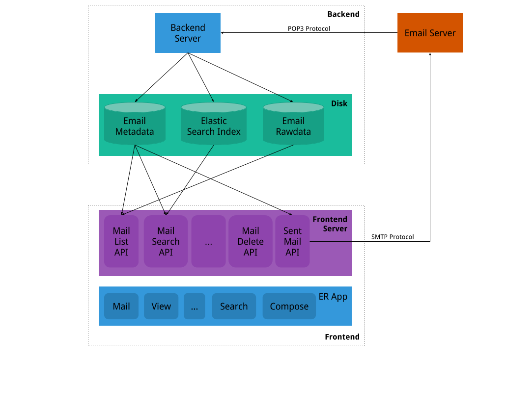
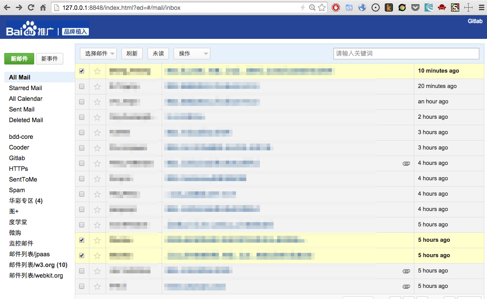
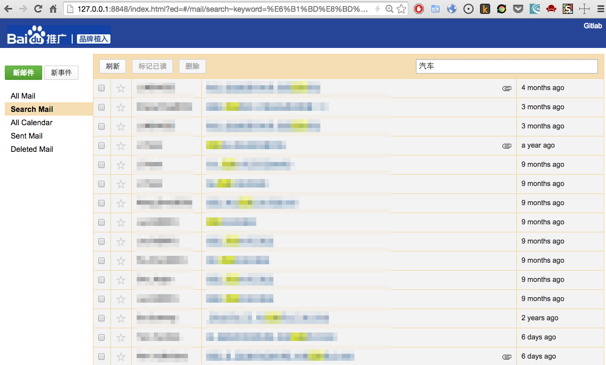
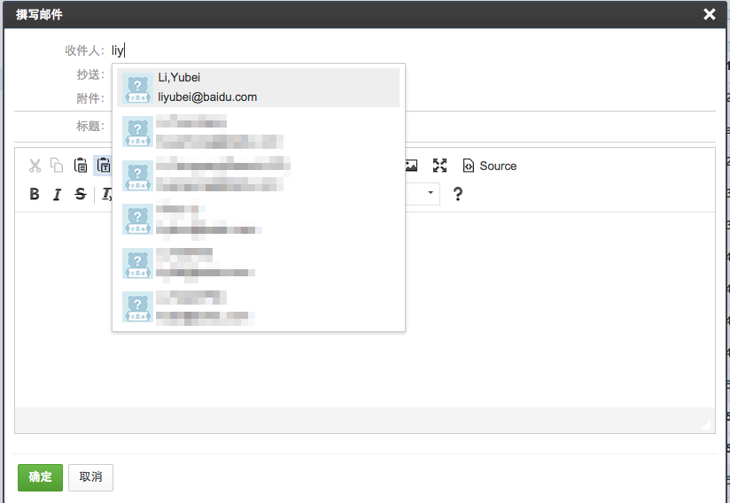
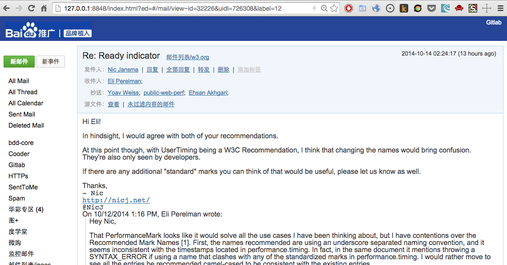
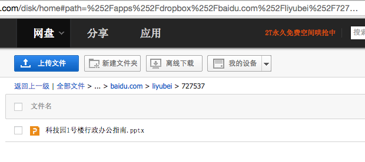
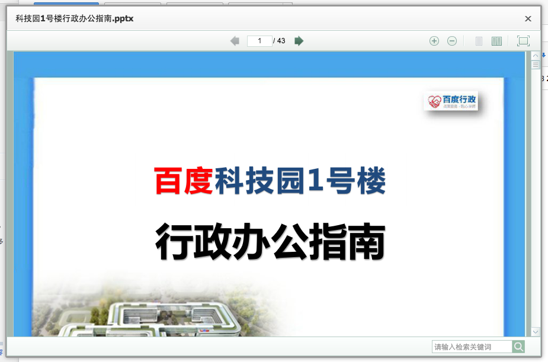

## 简介

EMail Client 基于 [POP3](http://en.wikipedia.org/wiki/Post_Office_Protocol) 和 [SMTP](http://en.wikipedia.org/wiki/Simple_Mail_Transfer_Protocol) 协议来实现邮件的收发功能，UI是基于在 [er](https://github.com/ecomfe/er), [esui](https://github.com/ecomfe/esui), [bat-ria](https://github.com/ecomfe/bat-ria) 的基础上开发的，天生具有很好的扩展性和跨平台的特性。

## 系统架构图



### BACKEND

1. 基于 POP3 协议跟邮件服务器交互，完成收取邮件的功能
2. 收取邮件之后把解析出来的元信息（例如：标题，发件人，日期等等）存储到数据，原始的文件存储到 Raw 目录，一些需要进行检索的信息发送到 elasticsearch 建立索引。

### FRONTEND

1. 基于 SMTP 协议跟邮件服务器交互，完成发送邮件的功能
2. 实现了一个 Web Server，响应浏览器发送过来的请求，返回合适的 JSON 数据，从而在 ER App 里面展示邮件的信息。

## 系统预览

### 邮件列表



### 邮件搜索



### 发送邮件



### 邮件浏览



### 查看附件

先进行网盘授权，授权之后邮件的附件是自动转存到百度云，方便预览。





## 环境搭建

基于上面的介绍，搭建环境之前需要有一些依赖的服务需要准备好：

0. [git](http://git-scm.com/)
1. [mysql](http://mysql.com/downloads)
2. [golang](http://golang.org/doc/install)

**注意事项**

Windows下面安装可能会遇到很多问题，推荐在 Linux 或者 Mac 下面尝试

### git

检出代码：`git clone http://gitlab.baidu.com/baidu/email.git`

### mysql

如果想要初始化一个特定的目录来存储相关的数据，可以这么做（需要修改参数的值）：

```
mysql_install_db \
  --basedir=MYSQL_BASE_DIR \
  --datadir=THE_DATA_DIR
mysqld --datadir=THE_DATA_DIR
```

如果想要用默认的话，就直接执行`mysqld_safe`，启动服务即可。

第一次使用之前初始化数据库，导入 `src/server/init.sql` 即可。

### golang

1. 下载依赖包：`git clone http://gitlab.baidu.com/liyubei/gopath.git`
2. 设置`GOPATH`环境变量：`export GOPATH=$(pwd)/gopath`
3. 编译一下

```
go install code.google.com/p/go.net/publicsuffix
go install github.com/alexcesaro/mail/quotedprintable
go install github.com/dustin/go-humanize
go install github.com/gorilla/schema
go install github.com/microcosm-cc/bluemonday
go install github.com/op/go-logging
go install github.com/qiniu/iconv
go install github.com/saintfish/chardet
go install github.com/stretchr/testify/assert
go install github.com/go-sql-driver/mysql
go install github.com/mattn/go-sqlite3
go install github.com/bytbox/go-pop3
go install gopkg.in/yaml.v1
```

### 使用jumbo

如果在开发机使用 jumbo 安装的话，可以执行如下的命令来部署环境：

```
jumbo add-repo ftp://st01-arch-platform00.st01.baidu.com/home/bambi/repo/tmp
jumbo install sun-java6 go mysql nodejs
export PATH=${JUMBO_ROOT}/opt/sun-java6/bin:$PATH
npm i -g edp edp-webserver --registry=http://npm.baidu.com
```

## 启动服务

### 修改配置

第一次启动服务之前需要创建`config.yml`，直接把`config.example.yml`复制为`config.yml`，然后修改一下里面的配置即可，主要是帐号相关的信息。

**注意事项**

1. 如果邮件服务器是`email.baidu.com`，那么`smtp`部分的用户名是`internal\username`，不是`username`
2. 配置更新之后，执行 `go run src/server/main.go` 即可，此时会自动创建 `data/server domain/username` 目录来存放收取的邮件或者解析出来的附件
3. 第一次收取邮件花费的时间比较久，请耐心等待

### 联系人信息

邮件收取完毕之后，执行`go run src/server/tools/fix_contacts.go`来初始化一下联系人列表，之后就可以撰写邮件的时候，看到联系人自动提示的功能了。

### 邮件浏览

开始收取之后，就可以启动`frontend`来查看邮件了：

1. go run src/server/frontend.go
2. cd src/client && edp webserver start

正常启动之后，可以通过 <http://127.0.0.1:8765/index.html?ed=1#/mail/inbox> 来查看邮件。

建议在 Chrome 或者 Firefox 下面进行使用，没有在 IE 下面进行测试，无法保证功能正常。当然，你也可以在这个测试环境下体验一把：<http://er-app-email.jpaas-idea.baidu.com/index.html#/mail/inbox>，发送邮件给<erappemails@126.com>，如果一切正常的话，过一分钟左右应该能看到新的邮件。

### 过滤器

邮件的过滤器主要是通过`filters.yml`来配置完成的，可以把`filters.example.yml`拷贝为`filters.yml`，进行一些调整来符合自己的需求。调整的时候参考现有的内容即可。常见的一个过滤器结构如下：

```
- filter:
  name: 邮件列表/w3.org
  stop: true
  condition:
    match: Any
    rules:
      - [SentTo, Contains, '@w3.org']
      - [SentTo, Contains, '@lists.css-discuss.org']
  action:
    Label: 邮件列表/w3.org
```

1. `filter.stop`类型是`bool`，如果设置为true，当符合这个过滤器的时候，就不再执行后续的过滤器
2. `filter.condition.match`取值范围是`Any`或者`All`，注意大小写。
3. 现在可用的`action`有`Label`, `MarkAsRead`, `MarkAsDelete`，后续如果想完善的话，可以直接在`src/server/base/action.go`里面去实现。

## FAQ

### 为什么不独立一个服务来访问，而是需要使用者自己来安装？

的确是的，独立服务访问会方便很多，但是因为收取和发送邮件都需要用户名和密码，独立服务之后必定要存储这些信息，很有可能会出安全隐患，所以不提供一个独立的服务。

### 跟 email.baidu.com 有啥区别？

本质功能是一样的，虽然有些功能还没有 email.baidu.com 完善，有些功能比 email.baidu.com 更易用（例如发送和浏览邮件的功能），而且定制性和扩展性更好，希望更多的童鞋参与进来。

### 为什么有些邮件收取不了呢？

这是因为 POP3 协议的限制，没有文件夹的概念。 如果在服务器上保存了 Outlook 的过滤器，可能会把一些邮件放到 非Inbox 文件夹下面，此时用 POP3 就无法收取了，建议停用所有的过滤器（非删除），这样子就能收取所有的有邮件了。